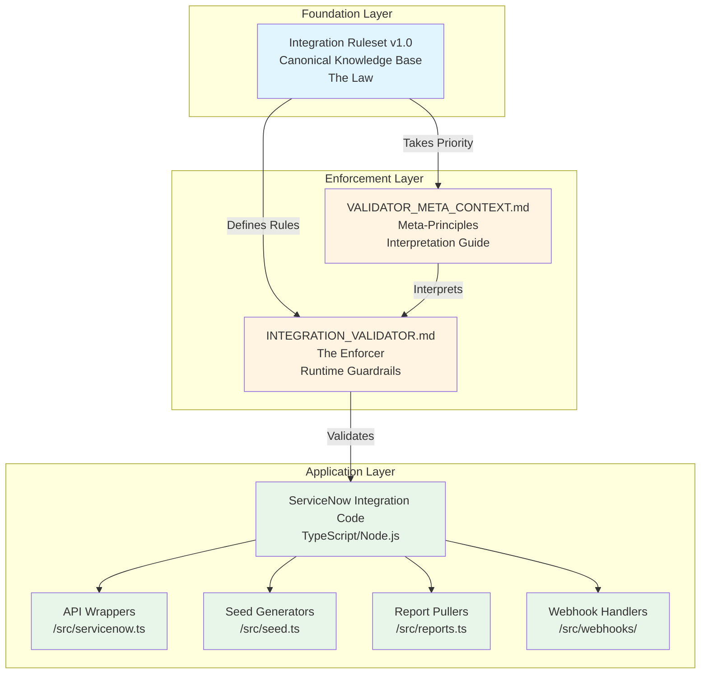
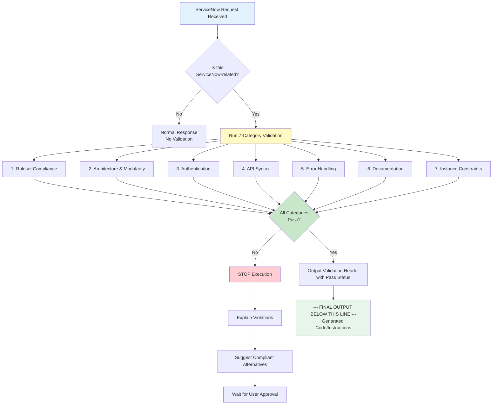
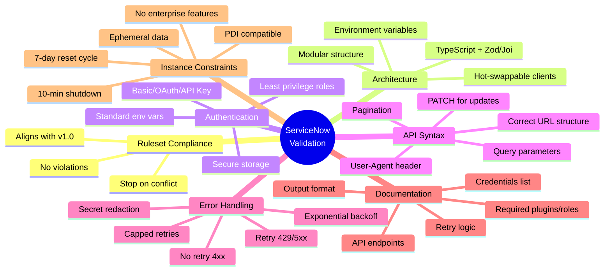
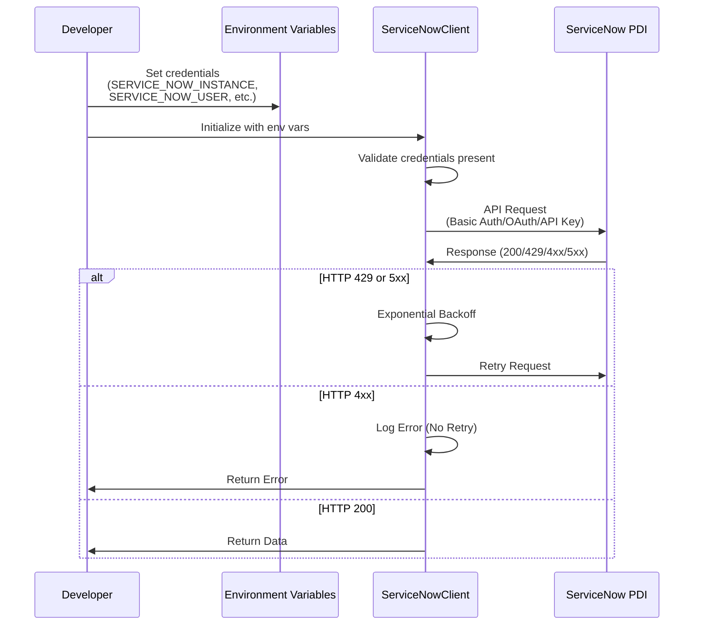

# ServiceNow Integration Playground

A comprehensive foundation for building compliant, production-ready integrations with ServiceNow Developer Instances (PDIs). This repository provides canonical rules, validation protocols, and enforcement mechanisms to ensure all ServiceNow integrations follow best practices, security standards, and platform constraints.

## 🎯 Docs & Integrations Help Desk

This repository includes a working **Docs & Integrations Help Desk** demo application that demonstrates:
- Incident intake and management
- KB article suggestions based on incident descriptions
- Incident resolution tracking
- Help desk statistics and deflection metrics

### Quick Start

```bash
# 1. Install dependencies
pnpm install

# 2. Configure environment
cp .env.example .env
# Edit .env with your ServiceNow PDI credentials

# 3. Seed data
pnpm seed

# 4. Start development server
pnpm dev
```

The server will start on `http://localhost:3000` (or port specified in `PORT`).

### cURL Smoke Tests

```bash
# Health check
curl -s http://localhost:3000/health

# List incidents
curl -s http://localhost:3000/incidents

# Create incident
curl -s -X POST http://localhost:3000/incident \
  -H "Content-Type: application/json" \
  -d '{"product":"Product X","short_description":"OAuth callback failing"}'

# Get KB suggestions (replace <SYS_ID> with actual incident sys_id)
curl -s -X POST http://localhost:3000/incident/<SYS_ID>/suggest

# Resolve incident (replace <SYS_ID> with actual incident sys_id)
# Note: Sets state=6, close_code="Solution provided", and close_notes from resolution_note
curl -s -X POST http://localhost:3000/incident/<SYS_ID>/resolve \
  -H "Content-Type: application/json" \
  -d '{"resolution_note":"Resolved via KB-0001"}'

# Get statistics
curl -s http://localhost:3000/stats
```

### Documentation

- **[API Reference](docs/API_REFERENCE.md)** - Complete API endpoint documentation
- **[Architecture](docs/ARCHITECTURE.md)** - System architecture and design decisions
- **[ServiceNow Integration](docs/SERVICE_NOW.md)** - ServiceNow API usage patterns
- **[Runbook](docs/RUNBOOK.md)** - Operational guide and troubleshooting

---

## 📚 Repository Overview

This repository contains three core documents that work together to establish a complete integration framework:

1. **Integration Ruleset v1.0** - The canonical knowledge base defining all ServiceNow integration rules
2. **INTEGRATION_VALIDATOR.md** - The enforcement layer ("The Enforcer") with validation checklists
3. **VALIDATOR_META_CONTEXT.md** - Meta-principles explaining how to interpret and apply the validator

---

## 🏗️ Architecture & Document Relationships



---

## 🔄 Validation Flow Process



---

## 🎯 Integration Architecture Pattern

```mermaid
graph LR
    subgraph "Local Environment"
        A[Environment Variables<br/>or GCP Secret Manager]
        B[config.ts<br/>Environment Config]
        C[ServiceNowClient<br/>API Wrapper]
    end
    
    subgraph "ServiceNow PDI"
        D[Table API<br/>/api/now/table/]
        E[Scripted REST API<br/>Custom Endpoints]
        F[Import Set API<br/>Bulk Ingestion]
    end
    
    subgraph "Integration Components"
        G[/src/servicenow.ts<br/>API Wrapper]
        H[/src/seed.ts<br/>Test Data Generators]
        I[/src/reports.ts<br/>Report Pullers]
        J[/src/webhooks/<br/>Outbound Handlers]
    end
    
    A --> B
    B --> C
    C --> G
    G --> D
    G --> E
    G --> F
    
    G --> H
    G --> I
    G --> J
    
    style A fill:#ffebee
    style B fill:#e1f5ff
    style C fill:#e8f5e9
    style D fill:#fff9c4
    style E fill:#fff9c4
    style F fill:#fff9c4
    style G fill:#e8f5e9
    style H fill:#e8f5e9
    style I fill:#e8f5e9
    style J fill:#e8f5e9
```

---

## 📋 Validation Categories



---

## 🔐 Authentication Flow



---

## 📦 What's Included

### Core Documents

| Document | Purpose | Role |
|----------|---------|------|
| **Integration Ruleset v1.0** | Canonical knowledge base | Defines all rules, constraints, and best practices |
| **INTEGRATION_VALIDATOR.md** | Validation checklist | Enforces ruleset compliance before code generation |
| **VALIDATOR_META_CONTEXT.md** | Interpretation guide | Explains how to apply the validator correctly |

### Key Features

✅ **Comprehensive Ruleset** - Complete coverage of authentication, API usage, rate limiting, and best practices  
✅ **Automated Validation** - 7-category validation ensures compliance before code generation  
✅ **No Assumptions Policy** - Always asks for clarification rather than guessing  
✅ **PDI-Optimized** - Designed specifically for Personal Developer Instances  
✅ **Security-First** - Enforces least-privilege access and secure credential storage  
✅ **Modular Architecture** - Prescribes clean, testable, maintainable code structure  

---

## 🚀 Quick Start

### 1. Understand the Foundation

Read the documents in this order:
1. **Integration Ruleset v1.0** - Learn the rules
2. **VALIDATOR_META_CONTEXT.md** - Understand how to apply them
3. **INTEGRATION_VALIDATOR.md** - See the validation checklist

### 2. Set Up Environment

Create a `.env` file with required credentials:

```bash
SERVICE_NOW_INSTANCE=your-instance.service-now.com
SERVICE_NOW_USER=your-username
SERVICE_NOW_PASSWORD=your-password
# OR for OAuth:
# SERVICE_NOW_CLIENT_ID=your-client-id
# SERVICE_NOW_CLIENT_SECRET=your-client-secret
```

### 3. Build Your Integration

Follow the prescribed architecture:
- `/src/servicenow.ts` - API wrapper
- `/src/seed.ts` - Test data generators
- `/src/reports.ts` - Report pullers
- `/src/webhooks/` - Outbound handlers

### 4. Validate Before Deploying

All code must pass the 7-category validation before being considered production-ready.

---

## 📖 Document Details

### Integration Ruleset v1.0

The canonical source of truth covering:
- **Authentication & Security** - Auth types, credential storage, role requirements
- **Rate Limiting & Retries** - Exponential backoff, error handling strategies
- **API Usage Rules** - Table API, Scripted REST API, Import Set API
- **Best Practices** - Code structure, modularity, testing strategies
- **Instance Constraints** - PDI limitations, plugin management, ephemeral data

### INTEGRATION_VALIDATOR.md

The enforcement layer with 7 validation categories:
1. **Ruleset Compliance** - Ensures alignment with v1.0
2. **Architecture & Modularity** - Verifies code structure
3. **Authentication** - Validates auth patterns and credentials
4. **API Syntax** - Checks API usage correctness
5. **Error Handling** - Ensures proper retry logic
6. **Documentation** - Verifies required documentation
7. **Instance Constraints** - Confirms PDI compatibility

### VALIDATOR_META_CONTEXT.md

Meta-principles explaining:
- Document hierarchy and relationships
- Enforcement behavior
- No-assumptions policy
- Clarification protocols
- Output format requirements
- Scope of application

---

## 🎓 Usage in AI Development

When using this repository with AI coding assistants (like Cursor):

1. **Load the Ruleset** - Provide "Integration Ruleset v1.0" as system context
2. **Activate the Validator** - Include "INTEGRATION_VALIDATOR.md" as enforcement layer
3. **Apply Meta-Context** - Use "VALIDATOR_META_CONTEXT.md" for interpretation
4. **Request ServiceNow Work** - AI will automatically validate all outputs

The AI will:
- ✅ Run 7-category validation before returning code
- ✅ Stop and explain if validation fails
- ✅ Ask for clarification when information is missing
- ✅ Never assume ServiceNow features exist
- ✅ Follow all ruleset guidelines automatically

---

## 🔒 Security & Best Practices

### Credential Management
- ❌ Never hardcode credentials
- ✅ Use environment variables or GCP Secret Manager
- ✅ Follow standard naming conventions
- ✅ Redact secrets in logs

### Access Control
- ❌ Never use global admin role
- ✅ Use service account with `web_service_admin` + specific roles
- ✅ Apply least-privilege principle

### Error Handling
- ✅ Retry with exponential backoff for 429/5xx
- ❌ Never retry 4xx client errors
- ✅ Cap retry attempts
- ✅ Log all failures with redacted secrets

---

## 📊 Supported APIs

| API | Description | Use Case |
|-----|-------------|----------|
| **Table API** | Full CRUD operations | Standard record management |
| **Scripted REST API** | Custom endpoints | Custom business logic |
| **Import Set API** | Bulk ingestion | Large data imports |

---

## ⚠️ PDI Constraints

ServiceNow Personal Developer Instances have specific limitations:

- **Inactivity Shutdown** - Automatically shuts down after 10 minutes of inactivity
- **Reset Cycle** - Resets if not accessed within 7 days
- **Ephemeral Data** - All data is temporary and may be lost
- **Plugin Activation** - Plugins must be manually enabled (cannot be done via API)
- **No Rate Limits** - No fixed global rate limits, but may return 429 if configured

### PDI Reset Recovery

If your PDI instance sleeps or resets:

1. **Wake the instance** - Access it via browser or API call
2. **Re-seed data** - Run `pnpm seed` to recreate KB articles and test incidents
3. **Verify connection** - Run `pnpm test` to confirm everything works

The service is designed to be idempotent - re-running seed operations won't create duplicates.

---

## 🤝 Contributing

This is a foundational ruleset. When updating:

1. **Ruleset v1.0** takes priority over validator
2. If conflicts arise, update the appropriate document
3. Maintain backward compatibility when possible
4. Document all changes clearly

---

## 📝 License

This repository contains documentation and rules for ServiceNow integration development. Use freely for your ServiceNow integration projects.

---

## 🔗 Related Resources

- [ServiceNow Developer Portal](https://developer.servicenow.com/)
- [ServiceNow API Documentation](https://docs.servicenow.com/)
- [ServiceNow REST API Explorer](https://docs.servicenow.com/bundle/vancouver-application-development/page/integrate/inbound-rest/concept/c_RESTAPI.html)

---

## ✅ Status

**Foundation Complete** - All core documents created and validated. Ready for ServiceNow-compliant integration development.

---

*Last Updated: 2024*

